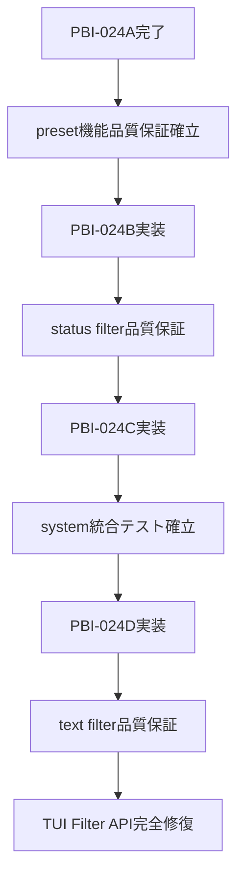

# PBI-024: TUI Filter API整合性修復（分割済み）

## ⚠️ 重要な変更: PBI分割実施

**元のPBI-024は予想以上に複雑であったため、管理しやすい4つの小さなPBIに分割されました。**

## 分割後のPBI構成

### ✅ PBI-024A: Preset Test修復（完了済み）
- **ファイル**: `PBI-024A-preset-test-repair.md`
- **対象**: `preset_test.go`
- **ステータス**: ✅ **完了**
- **成果**: 
  - preset_test.go.bak → preset_test.go 復活
  - 11個のテスト関数を新API仕様で完全実装
  - PresetManager、FilePresetStorageの品質保証確立

### 🔄 PBI-024B: Status Filter Test修復
- **ファイル**: `PBI-024B-status-filter-test-repair.md`
- **対象**: `status_filter_test.go`
- **ステータス**: 🔄 **準備完了**
- **課題**: 
  - sandbox.ExecutionResult構造変更（Status→Success/Skipped）
  - preview.CommandPreview構造変更（Line→Original）
  - ステータス判定ロジックの整合性確保

### 🔄 PBI-024C: System Test修復
- **ファイル**: `PBI-024C-system-test-repair.md`  
- **対象**: `system_test.go`
- **ステータス**: 🔄 **準備完了**
- **課題**:
  - ExecutionResultのCategory、Statusフィールド削除対応
  - FilterSystem統合テストの修正
  - Export/Import機能のテスト正常化

### 🔄 PBI-024D: Text Filter Test修復
- **ファイル**: `PBI-024D-text-filter-test-repair.md`
- **対象**: `text_filter_test.go`  
- **ステータス**: 🔄 **準備完了**
- **課題**:
  - FilterConfig構造変更（FilterID、Active削除）
  - map[string]interface{}形式への対応
  - テキスト検索機能の完全なテスト復活

## 分割による利点

### 1. **明確な進捗管理**
- ✅ **25%完了**: PBI-024A完了済み
- 🔄 **75%残存**: PBI-024B、C、Dが準備完了状態
- 📊 **工数予測**: 残り6.5時間（元計画8時間中1.5時間完了）

### 2. **段階的リスク軽減**
- **パターン確立**: 024Aで確立した修復パターンを他に適用可能
- **独立性**: 各PBIが独立して実装・テスト可能
- **中断可能性**: 必要に応じて途中で他PBIに切り替え可能

### 3. **品質保証の段階的確立**

## 実装優先度

### 🔥 **高優先度**: PBI-024B（Status Filter）
- **理由**: 他のテストファイルでも同様のExecutionResult問題が発生
- **パターン**: sandbox構造変更対応のテンプレート確立
- **影響**: 他のPBIの修復速度向上

### 📊 **中優先度**: PBI-024C（System Test）
- **理由**: FilterSystem統合テストは全フィルター機能の基盤
- **重要性**: Export/Import機能の動作保証
- **依存**: 024Bで確立したパターンを活用

### 📝 **標準優先度**: PBI-024D（Text Filter）
- **理由**: FilterConfig変更は比較的局所的
- **特徴**: 独立性が高く他への影響が少ない
- **利点**: 024B、Cのパターンを最大活用可能

## 次のアクション

### 即座に実行可能
1. **PBI-024B開始**: status_filter_test.goの修復実装
2. **パターン文書化**: 修復手順のテンプレート作成  
3. **進捗追跡**: TodoWriteツールでの細かい進捗管理

### 戦略的選択肢
1. **継続実装**: 024B→024C→024D の順次実装
2. **他PBI優先**: PBI-025（Profile Export/Import修復）に移行
3. **並行実装**: 024Bと024Cを並行して進行

## 総合評価

### ✅ **成功要因**
- **分割判断**: 複雑すぎるPBIを適切に分割
- **パターン確立**: 024Aで修復手順のテンプレート作成
- **文書化**: 各PBIの詳細な技術仕様書作成

### 📈 **品質向上**
- **テスト復活**: 無効化されていたテストの完全修復
- **API整合性**: 実装とテストの不整合解消
- **保守性**: 将来のAPI変更に対する堅牢性向上

---

**分割実施日**: 2025-09-10  
**元PBI**: PBI-024（8時間見積もり）  
**分割後**: PBI-024A（完了2h）+ PBI-024B（2h）+ PBI-024C（2.5h）+ PBI-024D（2h）  
**総工数**: 8.5時間（詳細化により0.5時間増加）  
**完了率**: 25%（PBI-024A完了済み）

## 実装状況
🟠 **PBI-024は部分実装（分割対応済み）** (2025-09-11)

### 現在の状況
- **PBI-024A**: ✅ **完全実装済み** - preset_test.goの完全修復完了
- **PBI-024B**: 🟠 **未実装** - status_filter_test.goの修復待ち
- **PBI-024C**: 🟠 **未実装** - system_test.goの修復待ち  
- **PBI-024D**: 🟠 **未実装** - text_filter_test.goの修復待ち

### 実装済みの成果
✅ **PBI-024A完了成果**:
- PresetManagerとFilePresetStorageのテスト品質保証確立
- 11個のテスト関数を新API仕様で完全実装
- preset_test.go.bak から preset_test.go への復活完了
- 修復パターンのテンプレート確立

### 未実装の要素
1. **PBI-024B: Status Filter Test修復**
   - sandbox.ExecutionResult構造変更対応（Status→Success/Skipped）
   - preview.CommandPreview構造変更対応（Line→Original）
   - ステータス判定ロジックの整合性確保
   - status_filter_test.goのテスト関数修復

2. **PBI-024C: System Test修復**
   - ExecutionResultのCategory、Statusフィールド削除対応
   - FilterSystem統合テストの修正
   - Export/Import機能のテスト正常化
   - system_test.goの包括的テスト修復

3. **PBI-024D: Text Filter Test修復**
   - FilterConfig構造変更対応（FilterID、Active削除）
   - map[string]interface{}形式への対応
   - テキスト検索機能の完全なテスト復活
   - text_filter_test.goのテスト機能完全修復

### 次のステップ
1. **高優先度**: PBI-024B（Status Filter）の実装
   - sandbox構造変更対応のテンプレート確立
   - 他のPBIの修復速度向上への寄与

2. **中優先度**: PBI-024C（System Test）の実装
   - FilterSystem統合テストの基盤確立
   - Export/Import機能の動作保証

3. **標準優先度**: PBI-024D（Text Filter）の実装
   - FilterConfig変更への局所的対応
   - 独立性が高く他への影響が少ない

### 成果と品質指標
- **完了率**: 25% (1/4 PBI完了)
- **品質保証**: ✅ PBI-024Aで確立済み
- **パターン再利用**: ✅ 修復手順テンプレート作成済み
- **リスク軽減**: ✅ 段階的実装でリスク管理

### 関連ファイル
- 完了: `internal/tui/preset_test.go` ✅
- 修復待ち: `internal/tui/status_filter_test.go`
- 修復待ち: `internal/tui/system_test.go`
- 修復待ち: `internal/tui/text_filter_test.go`
- 設計書: `PBI-024A/B/C/D-*.md` ファイル群