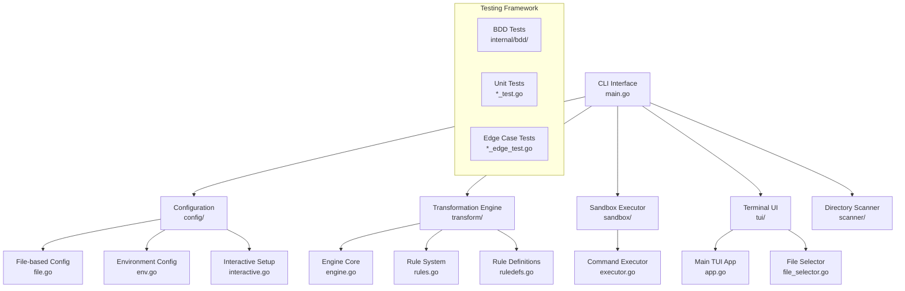
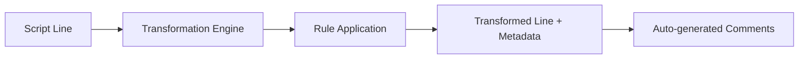
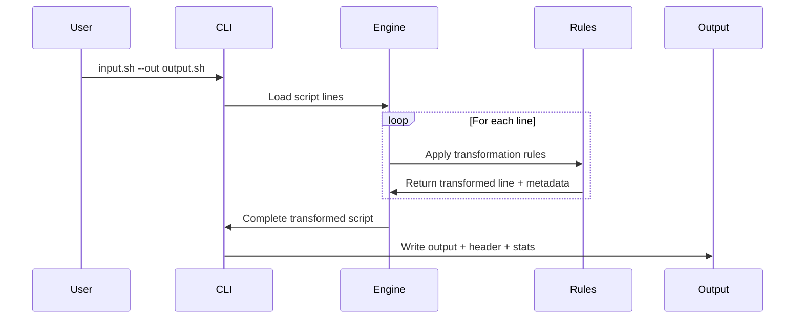
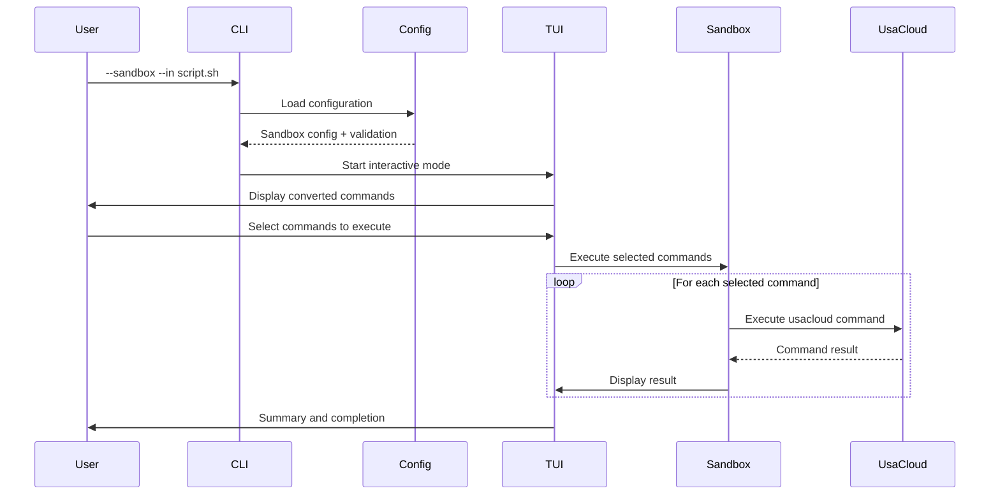

# アーキテクチャ詳細 v2.0

## システム概要

usacloud-update は、Sakura Cloud の usacloud CLI コマンドの変換と実行を行う多機能ツールです。従来のバッチ変換機能に加え、v1.9.0 でサンドボックス実行、TUI、BDD テストが追加され、包括的なクラウド運用支援ツールへと進化しました。

## アーキテクチャ全体図



## レイヤー構成

### 1. CLI レイヤー (`cmd/usacloud-update/`)

**責任**: ユーザーインターフェース、引数解析、実行フロー制御

#### 主要機能
- **デュアルモード実行**: 従来変換 vs サンドボックス実行
- **柔軟な入力ソース**: stdin、ファイル、ディレクトリスキャン
- **実行モード選択**: インタラクティブ vs バッチ vs ドライラン
- **マルチファイル処理**: 複数ファイルの一括処理

#### 実装特徴
```go
// main.go の主要な実行フロー
func main() {
    flag.Parse()
    if *sandboxMode {
        runSandboxMode()    // v1.9.0 新機能
    } else {
        runTraditionalMode() // 従来の変換機能
    }
}
```

### 2. 設定管理レイヤー (`internal/config/`)

**責任**: 設定ファイル管理、環境変数処理、対話的設定作成

#### 新しい設定アーキテクチャ (v1.9.0)
```go
type SandboxConfig struct {
    // Core settings
    AccessToken       string
    AccessTokenSecret string
    Zone             string
    
    // Execution control
    Enabled     bool
    Interactive bool
    DryRun      bool
    Debug       bool
    
    // Timeouts and limits
    Timeout         time.Duration
    MaxRetries      int
    CommandCooldown time.Duration
}
```

#### 設定の優先順位
1. **コマンドライン引数** (最高優先度)
2. **環境変数** (`SAKURACLOUD_*`)
3. **設定ファイル** (`~/.config/usacloud-update/usacloud-update.conf`)
4. **対話的設定作成** (初回実行時)

### 3. 変換エンジンレイヤー (`internal/transform/`)

**責任**: usacloud コマンドの構文変換、ルール適用

#### 変換パイプライン


#### ルールシステム
- **9カテゴリの変換ルール**: 出力形式、セレクタ、リソース名等
- **正規表現ベース**: 柔軟なパターンマッチング
- **自動コメント生成**: ドキュメントURL付きの説明コメント
- **メタデータ保持**: 変更前後の詳細な履歴

### 4. サンドボックス実行レイヤー (`internal/sandbox/`) - v1.9.0 新機能

**責任**: 実際のusacloudコマンド実行、結果管理、エラーハンドリング

#### 実行アーキテクチャ
```go
type ExecutionResult struct {
    Command    string        `json:"command"`
    Success    bool          `json:"success"`
    Output     string        `json:"output"`
    Error      string        `json:"error,omitempty"`
    Duration   time.Duration `json:"duration"`
    Skipped    bool          `json:"skipped"`
    SkipReason string        `json:"skip_reason,omitempty"`
}
```

#### 安全性機能
- **tk1vゾーン限定**: Sakura Cloud の無料ゾーンでの実行
- **コマンド検証**: usacloud コマンドのみ実行
- **タイムアウト保護**: 長時間実行の防止
- **レート制限**: API負荷軽減

### 5. ターミナル UI レイヤー (`internal/tui/`) - v1.9.0 新機能

**責任**: 対話的ユーザーインターフェース、ファイル選択、実行結果表示

#### TUI コンポーネント
- **MainApp** (`app.go`): メインのTUIアプリケーション
- **FileSelector** (`file_selector.go`): ファイル選択インターフェース
- **ヘルプシステム**: `?`キーでのヘルプ切り替え機能

#### 実装技術
- **tview**: リッチなターミナル UI フレームワーク
- **tcell**: 低レベルターミナル制御
- **動的レイアウト**: ヘルプパネルの動的表示/非表示

### 6. ディレクトリスキャナーレイヤー (`internal/scanner/`) - v1.9.0 新機能

**責任**: ディレクトリ内のスクリプトファイル検出、usacloudコマンド識別

#### スキャン機能
- **再帰的検索**: サブディレクトリを含む包括的スキャン
- **ファイルタイプ判定**: shell、bash、sh ファイルの自動検出
- **コマンド解析**: ファイル内のusacloudコマンド存在確認

## データフロー

### 従来の変換フロー


### サンドボックス実行フロー (v1.9.0)


## 依存関係管理

### 外部依存関係
```go
// go.mod の主要依存関係
require (
    github.com/cucumber/godog v0.15.1      // BDD testing
    github.com/fatih/color v1.18.0         // Terminal colors
    github.com/gdamore/tcell/v2 v2.8.1     // Terminal control
    github.com/rivo/tview v0.42.0          // TUI framework
    golang.org/x/term v0.28.0              // Terminal utilities
)
```

### 内部依存関係
- **config** → **interactive**, **file**, **env**
- **sandbox** → **config**
- **tui** → **config**, **sandbox**, **transform**
- **CLI** → すべてのモジュール

## セキュリティアーキテクチャ

### 認証・認可
- **APIキー管理**: 設定ファイルでの暗号化保存
- **ファイル権限**: 設定ファイルの自動権限設定 (600)
- **環境変数保護**: 機密情報の適切なスコープ管理

### 実行安全性
- **コマンド検証**: usacloud コマンドのみ実行許可
- **ゾーン制限**: tk1v ゾーン以外での実行制限
- **タイムアウト保護**: 無限実行の防止

## 拡張性とメンテナンス性

### 拡張ポイント
1. **新規変換ルール**: `ruledefs.go` への追加
2. **新しい実行モード**: CLI フロー分岐の拡張  
3. **TUI コンポーネント**: tview ベースの新しいUI要素
4. **新しい設定ソース**: config パッケージの拡張

### テスト戦略
- **56.1% テストカバレッジ**: 包括的なユニットテスト
- **8つの専用テストファイル**: 5,175+ 行のテストコード
- **BDD完全実装**: Godog による行動駆動テスト
- **エッジケーステスト**: 並行処理、エラー条件の検証

## パフォーマンス特性

### メモリ使用量
- **1MB バッファ**: 大きなスクリプトファイルの効率的処理
- **行単位処理**: メモリ効率的なストリーミング処理
- **ガベージコレクション**: Go の自動メモリ管理

### 実行時間
- **変換処理**: O(n) - 行数に比例
- **ルール適用**: O(r×n) - ルール数×行数
- **サンドボックス実行**: ネットワーク I/O に依存

## モニタリングとログ

### ログレベル
- **INFO**: 通常の実行ログ
- **DEBUG**: 詳細なデバッグ情報（`cfg.Debug=true`）
- **ERROR**: エラー情報（stderr 出力）

### 統計情報
- **変換統計**: 行別変更履歴、ルール適用回数
- **実行統計**: 成功/失敗/スキップ コマンド数
- **パフォーマンス**: 実行時間、API呼び出し回数

---

**文書バージョン**: v2.0  
**対応システムバージョン**: usacloud-update v1.9.0  
**最終更新**: 2025年9月8日